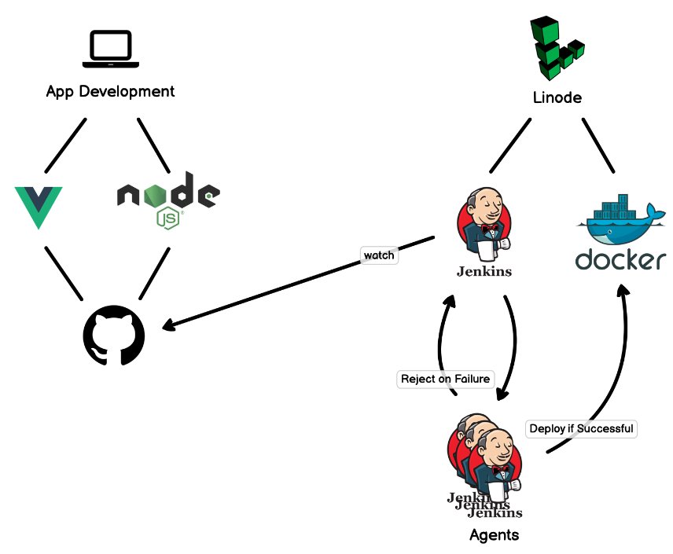

# Jenkins Project

Documentation [JenkinsDoc](https://www.jenkins.io/doc/)

Youtube Channel [Jenkins YouTube](https://www.youtube.com/channel/UC5JBtmoz7ePk-33ZHimGiDQ)

Jenkins is a tool used for automation wich CI/CD pipelines. The project started in 2004 and it is complety open source.

__Why to you use is it?__

It allows you to automatically watch for certain events in your repository and react to those events. You can do such as:

- build your code
- run scripts
- perform testing
- deploy your app if everything passes or recejt the deployment if the test fails

Either way, you can see logs of every step throughout the Jenkins pipline and the results of the deployment. Jenkins allows you to run all your tests in the same environment or as many environments as you want.

Jenkins is a plug-in architecture so we can install the plugins which make sense for your project like docker and git plugin etc.

Jenkins is self-hosted by default, you do not need to pay for an enterprise tier.

## Jenkins & Related Terms

| Syntax     | Description | 
| :----:     |    :---    | 
| CI         | Continuous Integration | 
| CD         | Continuous Delivery    |
| Pipline    | Series of steps that *build, test & deploy automatically to environments  | 
| Controller | Main instance of Jenkins that is running. Is responsible for configuration, key management, | 
|            |  plugins and centrilized hub to manage all of the agents connecting to it    |
| Agents     | Are usually containerized envs that run your pipline steps (aslo called jobs)    |

\* Build step will spin up an environment, compile code and create an execuable if necessary. 

## Architecture

